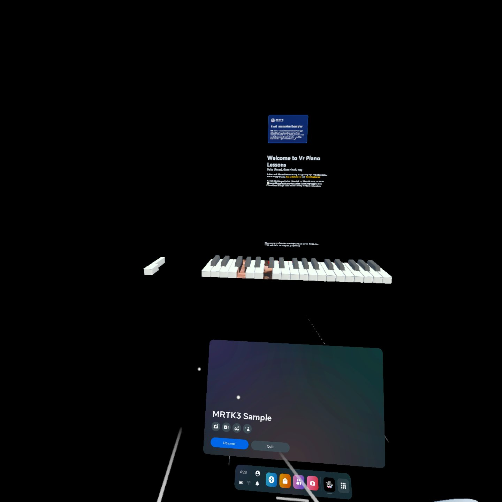
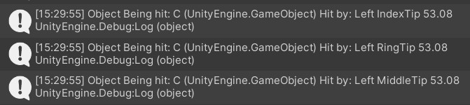
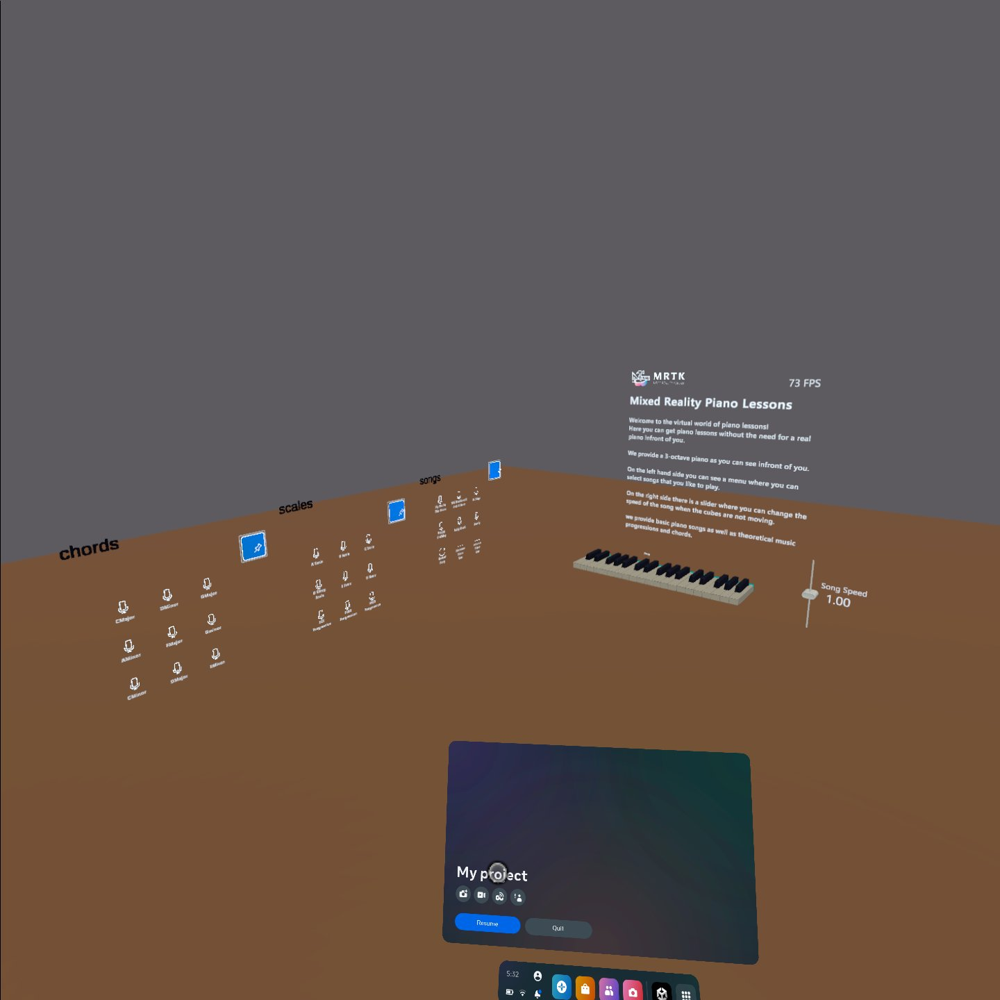

# PianoLearner

the project was built using MRTK 2.8 and unity, scripts are done using C#.

#### week 1 to week 3 :-
pitching in ideas until we reached the piano learning in VR.

#### week 4 :-
started working on the project, not much was done, after our meeting I saw some videos about MRTK.

#### week 5:-
downloaded MRTK and came to the lab to upload the example scene on the metaquest VR headset to try it out.

#### week 6-7:-
built the piano and started messing around with the scripts and learning a bit of C# with unity functionalities.

had some git trouble, something called artifact DB and cache stuff was really making git pushing take very long, soleved it by updating the gitignore (found something online for unity).

had problems with coloring the black keys.

after our meeting, I changed the piano functionalities to chaging the key from time to actually clicking it, so instead of learning the song via time we learn it via actually pressing the piano keys.
updated the script to add midi cubes based on the song files, it calculates the length based on the note length, makes a list of the notes, then destroys them when the note is clicked, and added some songs to test it out on menus using the built in MRTK prefabs, added floor and background as well.
fixed the black key issue, it turns out the black keys in unity were made using the transparent background and not a black material, solved it by assigning it a different material then chaging the materials color. (apparently they did that for less processing power)
added color functionalities.

the scene at that time:-

#### week 8-10:-
didnt work, had exams period and left the country for a bit.

#### week 11:-
researched how collisions are made, managed to do collisions between 2 gameobjects and print it.

modified it for finger tip collision.

then applied it to the piano that way we can play it using all fingers and not just the index which was the interactable.

