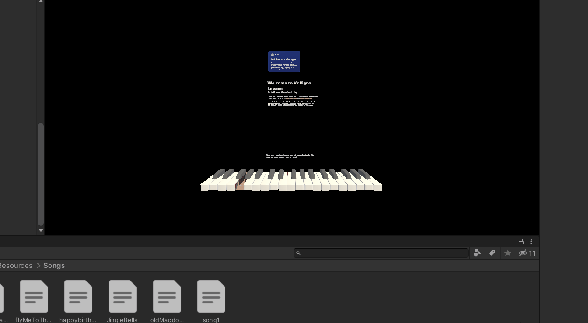
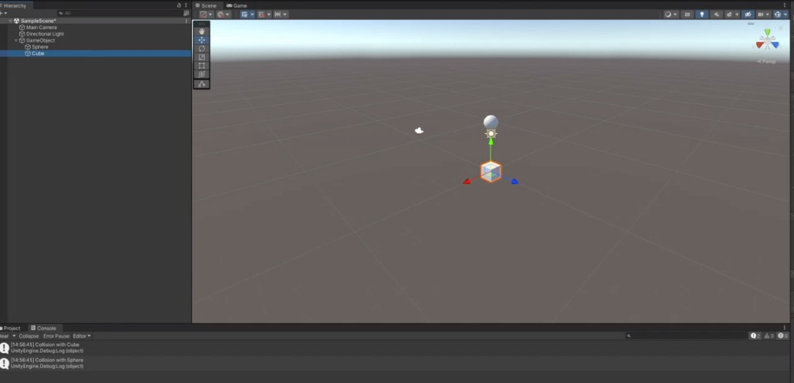
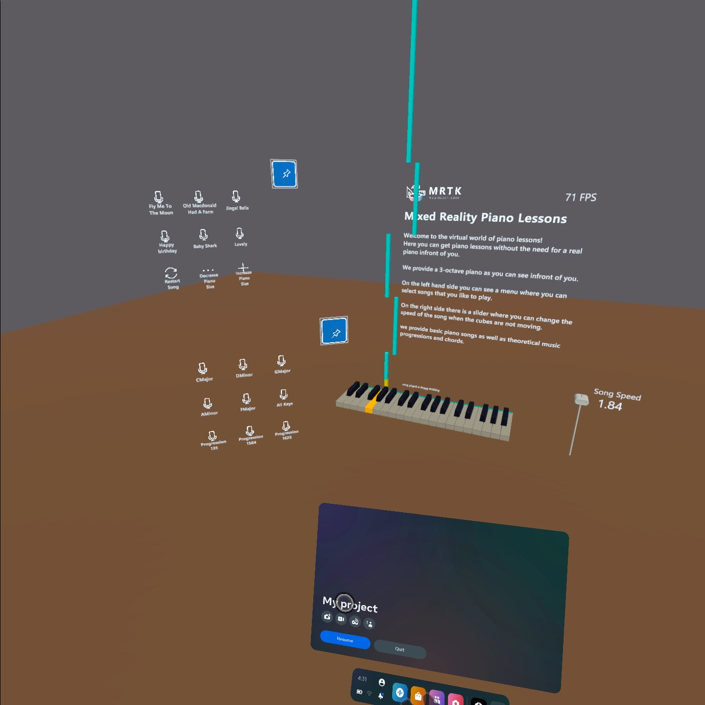

# PianoLearner

the project was built using MRTK 2.8 and unity, scripts are done using C#.

Demo: https://www.youtube.com/watch?v=bXe8Pc2Vq2U&ab_channel=TheJojitto95

Jerry's Progress:-
#### week 1 to week 3 :-
pitching in ideas until we reached the piano learning in VR.

#### week 4 :-
started working on the project, not much was done, after our meeting I saw some videos about MRTK.

#### week 5:-
downloaded MRTK and came to the lab to upload the example scene on the metaquest VR headset to try it out.
worked out great, did more research on MRTK.

#### week 6-7:-
built the piano and started messing around with the scripts and learning a bit of C# with unity functionalities.

had some git trouble, something called artifact DB and cache stuff was really making git pushing take very long, soleved it by updating the gitignore (found something online for unity).

had problems with coloring the black keys.

after our meeting, I changed the piano functionalities to chaging the key from time to actually clicking it, so instead of learning the song via time we learn it via actually pressing the piano keys.
updated the script to add midi cubes based on the song files, it calculates the length based on the note length, makes a list of the notes, then destroys them when the note is clicked, they fall down using linear interpolation and made them stop halfway if the necessary key for the cube has not been clicked, and added some songs to test it out on menus using the built in MRTK prefabs, added floor and background as well.
fixed the black key issue, it turns out the black keys in MRTK were made using the transparent background and not a black material, solved it by assigning it a different material then chaging the materials color. (apparently they did that for less processing power)
added color functionalities and themes like when the hand is near a button or a ray is cast it changes the color of the key.

the scene at that time:-

script functionalitites:-
whenever we click the necessary key, it cahnges to the next key.

I added multi notes capabilities, now I can also add more than 1 note at a time, like chords and stuff in the song file.

added a song speed slider such that the linear interpolations will be faster or slower.

fixed a couple of exceptions.

#### week 8-10:-
didnt work, had exams period and left the country for a bit.

#### week 11:-
researched how collisions are made, managed to do collisions between 2 gameobjects and print it.

modified it for finger tip collision.

then applied it to the piano that way we can play it using all fingers and not just the index which was the interactable.

added a handle bar to move the piano more freely because I made the box colliders of the key smaller.

Lama's Progress:-

week 4-5:

At first I added the floor and the background, it took some time because there is many ways to do it,
and each one had a way of view so it took some time to figure which one is the right one to our project.

week 6-7 :

I looked for some appropriate songs, an easy one that could teach begginers how to play on the piano, it took some time, due to that
most of the songs are hard to play, 

week 8-9 :

I fixed the timing of the songs, it was so slow, and added new menu for the chords and progression, I dont have a music background so it took a while, to get how it works.